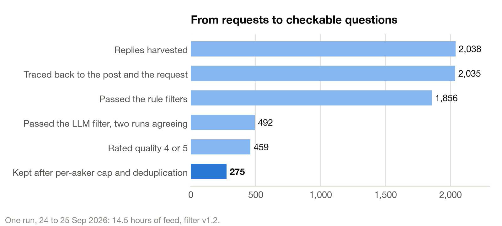
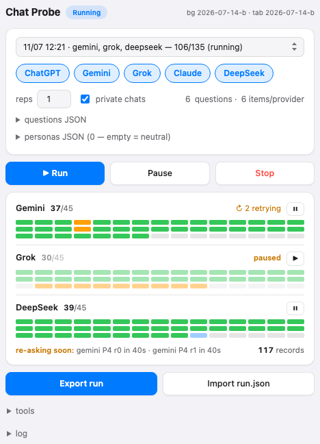
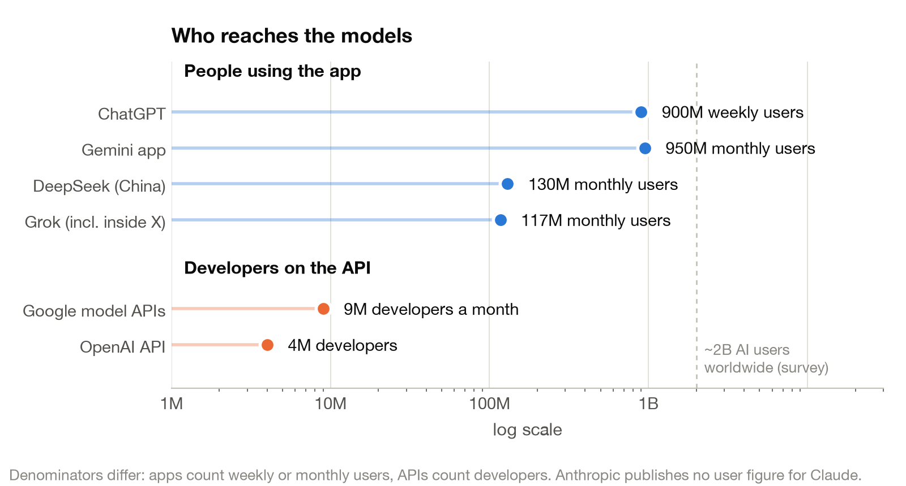

<h1 align="center">churvey</h1>

<b>Which chatbot can you trust on the news? Ask them where people ask, check every claim, show the evidence.</b>

   

People now ask chatbots about the news. They ask in the apps, not through the API, and the apps wrap the same models in system prompts, web search, memory, live model routing and A/B tests that no API benchmark sees. churvey is a pipeline for measuring how reliable each chatbot is on the political questions people are actually asking this week. It harvests those questions from public "is this true?" requests, puts each one to five chatbots through their real interfaces, splits every answer into checkable claims, verifies each claim against the open web, and publishes a per-chatbot score with every piece of evidence one click away. The method is borrowed from the long-form factuality literature. What is new is the subject, live political questions, the surface, the consumer apps, and the transparency: no verdict without a browsable trail.

<picture><source media="(prefers-color-scheme: dark)" srcset="docs/figures/pipeline-dark.svg"></picture>

## 1. Source: the questions people are asking

Every day, thousands of people on X tag a chatbot under a post to ask whether it is true. Those requests are a live feed of what the public wants checked. The harvester follows each one back to the post, and a filter rewrites it as a single self-contained, dated question with a checkable answer, dropping opinion polls, predictions and anything about a private individual.

One run, 14.5 hours of feed, filter v1.2: 2,038 requests harvested, 275 questions kept, about 19 an hour. Filtering cost under a dollar.

Four of the questions kept in that run, as the filter rewrote them:

- *Le rendement de l'OAT française à 10 ans a-t-il grimpé vers 4,7 % le 24 septembre 2026, un plus haut depuis 2008 ?* — Did the 10-year French government bond yield climb toward 4.7% on 24 September 2026, its highest since 2008?
- *Est-ce que le président Emmanuel Macron a déclenché l'article 16 de la Constitution le 24 septembre 2026 ?* — Did President Emmanuel Macron invoke Article 16 of the Constitution (emergency powers) on 24 September 2026?
- *La Turquie a-t-elle devancé la France dans les trois domaines (mathématiques, lecture, sciences) du classement PISA 2025, publié en septembre 2026 ?* — Did Turkey outscore France in all three PISA 2025 domains (maths, reading, science), published in September 2026?
- *Le déficit public de la France a-t-il atteint plus de 6 % du PIB avec un trou de 54 milliards d'euros en septembre 2026 ?* — Did France's public deficit exceed 6% of GDP, with a 54-billion-euro shortfall, in September 2026?

Eight sample questions with glosses are in [docs/questions_sample.md](docs/questions_sample.md).

## 2. Survey: ask the apps, not the API

A Firefox extension runs in an ordinary logged-in browser. For each question and each chatbot it opens a fresh chat, types the question, and captures the answer and its citations from the network stream rather than the rendered page. Questions are repeated, because the same app gives different answers on different days. Requests are paced to keep load low and back off on any limit.

This stage has been through one full audit. Before the August 2026 Michigan primary it put fourteen election questions to ChatGPT, Claude, Gemini, Grok and DeepSeek, five times each, and every answer was graded against a checklist quoted from official sources.

 

Completeness is not truthfulness. Grok covered the most facts; ChatGPT made the fewest false claims; Claude made the most, including sending a voter to the building where ballots are counted instead of the clerk's office. Gemini is hollow: a capture bug kept it in one running conversation.

The full case study, with every graded answer and the method's lessons, is at [docs/michigan_2026.md](docs/michigan_2026.md).

## 3. Decompose: from an answer to its claims

A chatbot's answer to a political question is a few hundred words of facts, forecasts, hedges and framing. Only the facts can be checked. This stage splits each answer into atomic claims, each carrying the context it needs to stand alone (who, when, where), and sets aside what cannot be verified: predictions, opinions, and statements about what "many" think.

**Illustrative decomposition, produced by hand for this page.** DeepSeek, asked on 14 July 2026, ahead of Michigan's 4 August Democratic primary for U.S. Senate: *"How do Abdul El-Sayed and Haley Stevens differ on immigration?"* (question C4, repeat 5 in [`data/michigan_2026/grades.csv`](data/michigan_2026/grades.csv)). Excerpt:

> - **Abdul El-Sayed**: As a progressive figure, he generally aligns with comprehensive immigration reform, pathways to citizenship, and immigrant rights, often emphasizing humanitarian and public health perspectives.
> - **Haley Stevens**: As a moderate Democrat in a competitive district, she typically supports immigration reform but often emphasizes economic contributions and border security, reflecting her district's diverse, suburban makeup.
>
> [...] it's likely that **Abdul El-Sayed takes a more left-wing stance** (e.g., favoring fewer enforcement measures) [...]

Atomic claims, each checkable on its own:

1. As of July 2026, Abdul El-Sayed, a candidate in Michigan's 4 August 2026 Democratic primary for U.S. Senate, supports comprehensive immigration reform.
2. As of July 2026, Abdul El-Sayed supports a pathway to citizenship for undocumented immigrants.
3. As of July 2026, Haley Stevens, his opponent in that primary, supports immigration reform.
4. As of July 2026, Haley Stevens represents a competitive U.S. House district in Michigan.

Set aside, not scored:

- "often emphasizing humanitarian and public health perspectives" (framing)
- "reflecting her district's diverse, suburban makeup" (framing: an unattributed motive)
- "it's likely that Abdul El-Sayed takes a more left-wing stance" (speculation)

The extractor is Claimify [1], chosen because it is the only method tested head to head on the step that matters most here: deciding what in a sentence is checkable at all. It keeps a claim only when three independent readings agree it is verifiable, rewrites mixed sentences to keep the factual part, and gives up on anything it cannot disambiguate rather than guess. On top of it runs a narrow repair pass in the spirit of VeriFact [2], which checks each claim for a missing time period, condition or comparison and fills it in from the answer and the question date. The extractor matters more than it looks: on the same 396 answers, published extractors produce anywhere from 7,400 to 27,700 claims [1], and the same responses score 76 under one factuality pipeline and 57 under another [3]. So the decomposer is fixed, versioned and published with every result, and a sensitivity check across extractors ships next to the scores.

## 4. Check: every claim against the open web

Each claim goes out as a web search. A language model then reads all the evidence together, including every page the chatbot itself cited, and returns one of three verdicts: supported, contradicted, or unverifiable. Two rules follow from the literature and from our own pilot. A claim is never marked contradicted on a single page, and every contradicted claim is read by a person before it is published.

## 5. Score: rank chatbots, don't rule on sentences

For each chatbot: the share of its claims supported, contradicted and unverifiable, the share of its citations that actually support what they are cited for, and the trend over time. Saying "I don't know" is never penalised.

Two honest limits shape the design. Automated verdicts on single claims are noisy, so the unit of trust is the ranking across hundreds of claims, never a verdict on one sentence. And because the extractor alone can double or halve the number of claims an answer yields, scores are only comparable within one published pipeline version.

## Why the app and not the API

Who reaches the models. Apps count people (weekly or monthly users); APIs count registered developers, the only public figure. Order of magnitude only; sources in <a href="docs/reach.md">docs/reach.md</a>.

The app is a different product from the model behind it, and the vendors say so.

Anthropic publishes the system prompts used in the Claude apps and notes they do not apply to the API; ChatGPT routes each message between models in real time and tests changes on live users; memory and web search are on by default in the apps and opt-in on the API.

Sources for every figure and claim in this section: [docs/reach.md](docs/reach.md).

## Scope and ethics

- Questions come from public posts only; the filter drops private individuals and ongoing criminal cases.
- Surveys use the auditor's own accounts, paced, with backoff; no captcha, fingerprint or evasion tooling.
- Only the auditor's questions and the chatbots' answers are collected; contradicted claims are human-reviewed.
- This is research software in development. Nothing here is a ranking yet.

## In the repo

- `ff/` the Firefox extension that runs the survey; `analysis/` grading pipeline and report builders.
- `data/michigan_2026/` every graded answer from the pilot, the questions, the checklists and their sources.
- `docs/`: [the Michigan case study](docs/michigan_2026.md), [sample questions](docs/questions_sample.md), [reach sources](docs/reach.md), [references](docs/references.md).

## References

1. Dasha Metropolitansky and Jonathan Larson. 2025. Towards Effective Extraction and Evaluation of Factual Claims. In *Proceedings of ACL 2025 (Volume 1: Long Papers)*. https://arxiv.org/abs/2502.10855
2. Xin Liu, Lechen Zhang, Sheza Munir, Yiyang Gu, and Lu Wang. 2025. VeriFact: Enhancing Long-Form Factuality Evaluation with Refined Fact Extraction and Reference Facts. In *Proceedings of EMNLP 2025*, pages 17908-17925. https://arxiv.org/abs/2505.09701
3. Farima Fatahi Bayat, Lechen Zhang, Sheza Munir, and Lu Wang. 2025. FactBench: A Dynamic Benchmark for In-the-Wild Language Model Factuality Evaluation. In *Proceedings of ACL 2025 (Volume 1: Long Papers)*. https://arxiv.org/abs/2410.22257

Full list, including the related work not cited above: [docs/references.md](docs/references.md).

Issues and pull requests are welcome.
