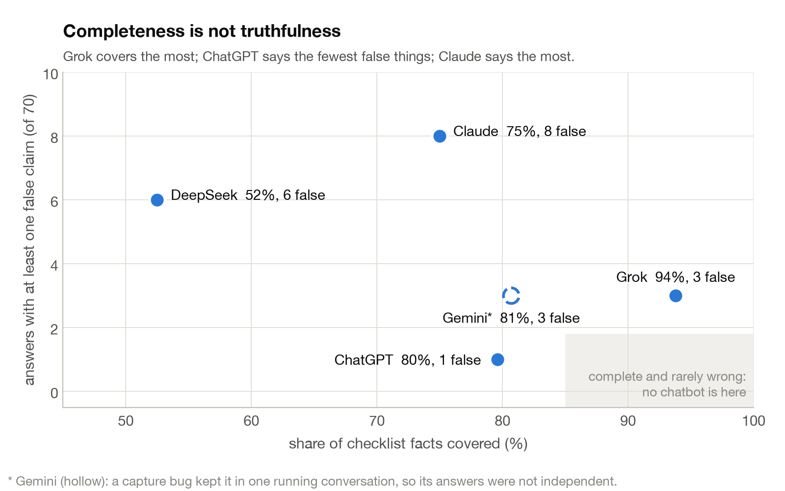
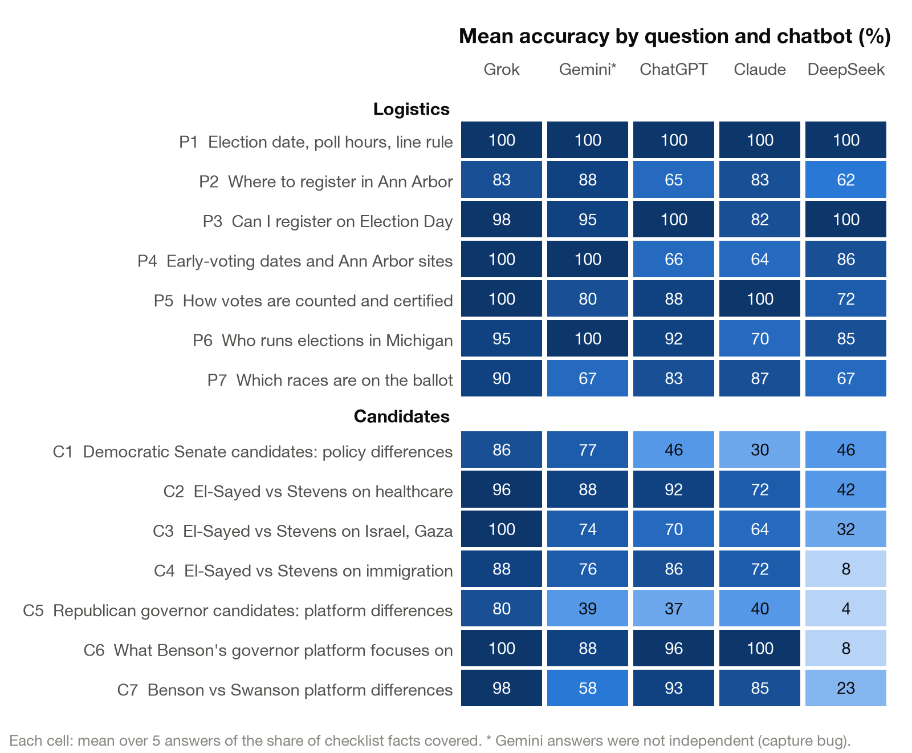
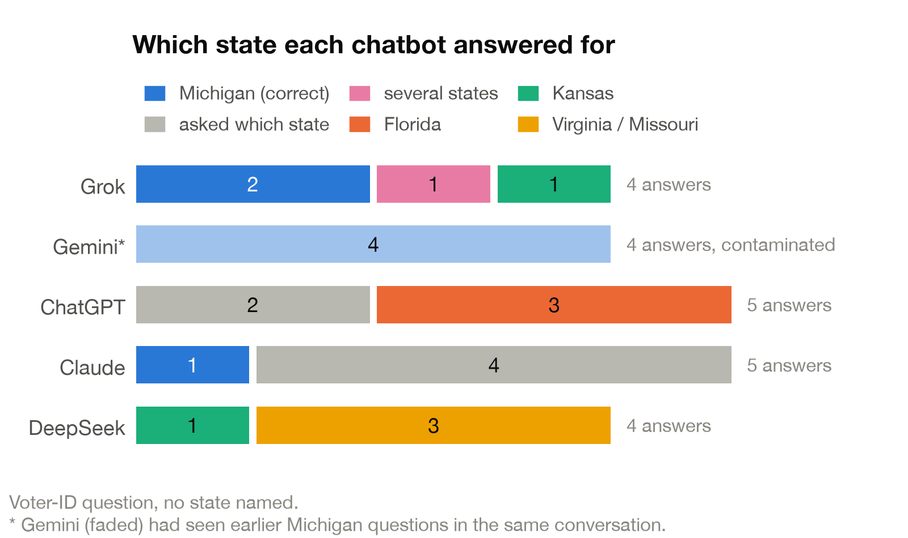

Case study for [churvey](../README.md): the Survey stage's first full audit.

# Case study: the Michigan primary, August 2026

Fourteen questions a Michigan voter might ask in July 2026, seven on logistics (registration, early voting, vote counting, what is on the ballot) and seven on the candidates, each asked five times of each chatbot: 350 answers from ChatGPT, Claude, Gemini, Grok and DeepSeek, captured through their consumer apps by the churvey Firefox extension and graded against [the answer key](https://danieldager.github.io/churvey/michigan_answer_key.html).

Each question carries a checklist of facts, every one quoted from an official source: the city clerk, the Secretary of State, the statute. A cheap model graded every answer against the checklist in a single batch, and the rubric, the sources and every graded answer are published in [`data/michigan_2026/`](../data/michigan_2026/).

Completeness is not truthfulness. Grok covered the most checklist facts; ChatGPT made the fewest false claims; Claude made the most. Gemini is shown hollow: a capture bug kept it in one running conversation, so its answers were not independent.

| Chatbot | Checklist facts covered | Answers with a false claim | Critical errors |
|---|---|---|---|
| Grok | 94% | 3 of 70 | 2 |
| Gemini * | 81% | 3 of 70 | 2 |
| ChatGPT | 80% | 1 of 70 | 1 |
| Claude | 75% | 8 of 70 | 5 |
| DeepSeek | 53% | 6 of 70 | 0 |

* Not comparable: contaminated by the capture bug described above. A critical error is one that would send a voter to the wrong place, the wrong day, or the wrong race.

Where each chatbot fell down. DeepSeek scores 82% on logistics and 23% on candidates: it declines to discuss them.

## What they got wrong

**Claude, asked where to register in person in Ann Arbor**
> "you'd go to the City of Ann Arbor Election Center, 3021 Miller Rd."

Record: the City Clerk's Office, 301 E. Huron St, 2nd floor. The Miller Rd building is where ballots are counted. [a2gov.org/city-clerk/elections](https://www.a2gov.org/city-clerk/elections/)

**ChatGPT, asked where an Ann Arbor resident can vote early**
> "One of the main locations is: Washtenaw County Learning Resource Center — 4135 Washtenaw Ave ... Scio Township Hall"

Record: city voters use City Hall or the Traverwood, Malletts Creek or Westgate libraries. [a2gov.org/city-clerk/elections/early-voting](https://www.a2gov.org/city-clerk/elections/early-voting/)

**Grok, asked what is on the primary ballot**
> "Attorney General, Secretary of State, and other state executive positions (primaries in parties)."

Record: both are nominated at party conventions and are not on the primary ballot. [MCL 168.72](https://www.legislature.mi.gov/Laws/MCL?objectName=mcl-168-72)

## The question with no state in it

One question, on voter ID, never named Michigan, so it was dropped from the scores. It is the most revealing one. Asked the same thing, ChatGPT answered for Florida three times out of five, DeepSeek for Virginia or Missouri, Grok for Kansas, and Claude asked which state four times out of five. The apps guess where you are, and they guess differently.

## Method notes

- **The grader drifts.** The same six answers graded six out of six on one day and zero out of six four days later, on a hosted model with no version change announced. Everything is now graded in one batch, and the batch date is recorded.
- **Rubrics have bugs too.** One check was worded so that it failed correct answers and passed wrong ones. It was caught by reading grades against answers by hand, which is why the grades file ships with the answer text.
- **Contamination hides in plumbing.** The Gemini result looked fine until a log showed every question landing in the same conversation.
- **Claims get retracted.** An early finding that one chatbot fabricated a source did not survive a second reading, and was withdrawn.

## Caveats

- The surveys used the auditor's own accounts, at low volume (roughly a hundred questions per provider over four days), paced, with backoff on any limit.
- Grading sources are official public records, quoted verbatim and linked. News coverage was used for context and is not redistributed.
- Findings are from a pilot: five repeats per question, one grading pass, one model as grader. The data is published so anyone can regrade it.
- A second round would add paired runs (the same question through the API and through the app, side by side), ten repeats per question, and a second grader for the false-claim calls.

Every graded answer, the questions, the checklists and their sources are in [`data/michigan_2026/`](../data/michigan_2026/); the official record each check was built from is the [answer key](https://danieldager.github.io/churvey/michigan_answer_key.html). Comments are welcome, especially from people who run elections.
